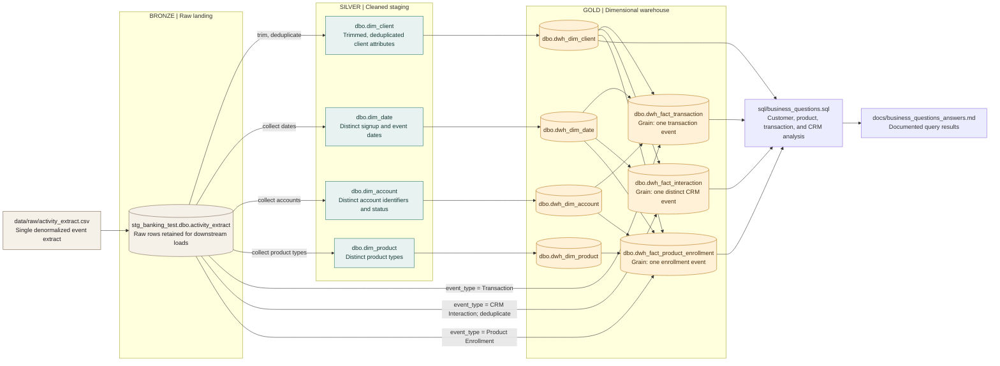

# Customer 360 Medallion Architecture

This diagram maps the repository's SQL Server pipeline to the medallion pattern. Bronze, Silver, and Gold are conceptual layers here; the project uses SQL Server databases and tables, not a separate lakehouse platform.

## How to read the flow

- The raw CSV is imported into `stg_banking_test.dbo.activity_extract` as the landing source.
- The staging script trims whitespace and derives client, date, account, and product lookup tables. The client table is deduplicated by its selected source attributes.
- The warehouse loader builds dimensions from those staging tables. It builds the transaction, interaction, and enrollment facts from the landing extract, using `event_type` to select each event family and joining to warehouse dimensions for surrogate keys.
- The business-question queries use the Gold warehouse tables for analysis. Question 4 also reads the raw landing table to measure source-quality issues.

## Operational notes

The scripts in `docs/run_instructions.md` describe the execution order and verification points. `verify_stg_tables.sql` checks the landing and staging row counts; `verify_dwh_tables.sql` checks warehouse counts, duplicates, and orphan keys. The repository documents importing the CSV into the landing table before running the SQL transformations; it does not include an SSIS project/package implementing the flow.